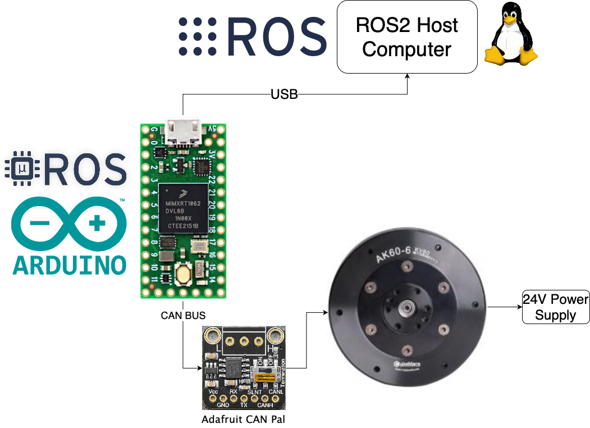

# ROS2/micro-ROS adapter for T-motor's (AK Series) Robotic Actuators

This repo contains codes to interact with [t-motor's AK series robotic actuators](https://store.tmotor.com/category-97-b0-AK+Series+Dynamical+Modular.html) from ROS2.
For this, I created a [teensy](https://www.pjrc.com/store/teensy40.html)-based driver with [micro-ROS](https://micro.ros.org) using the Arduino framework over the CAN Bus interface.
The firmware supports both servo and MIT contoller mode, but you need to set this using the Rubik Link V2.0.
Once the correct mode is set, you can interact with the motor by subscribing and publishing to relevant topics.

⚠️ NOTE: This is a work in progress.
I am able to run the following with relative ease and persistence, and I am trying my best for you to have fewer problems, but **expect bugs**.
I am using the AK60-6 V1.1 motor.

## Folder Structure

- `./docker`: This folder holds all configurations of docker images used in development.
- `./teensy`: This folder contains the platformio project that is used to generate the teensy firmware.
- `./ros2_ws`: This folder is the ros2 workspace volume.
- `./ros2_ws/src/example_usages`: This folder contains an example usage with a joystick.

## Getting Started

### Wiring Overview



### Teensy Firmware Setup

First, connect your Teensy to your computer.

### Linux

Loading the firmware to Teensy is very easy thanks to Docker and USB passthrough in Linux.
Simply run the following service.
(If it hangs or fails in flashing, re-run it multiple times. It takes me at least three runs to successfully flash)

```
docker compose up ros2-teensy-firmware-flasher
```

Above service uses caching with volumes to speed up development.
It will take time setting up PlatformIO, Teensy and build the firmware (about 10-15 minutes), but subsequent runs should be fast (<15 seconds).
Once done, you can just delete the new folders and docker images, and all the setup will be purged from your computer.

### MacOS

Docker doesn't allow USB-passthrough on non-Linux operating systems, so you need to flash the .hex file from your system.
To generate the .hex file, run the following service.

```
docker compose up ros2-teensy-firmware-builder
```

Then, you can find the firmware at `teensy/.pio/build/teensy40/firmware.hex`.
You can flash to Teensy using [Teensy Loader](https://www.pjrc.com/teensy/loader.html).
If you have [PlatformIO](https://platformio.org) installed in your system, you can also simply run below to flash using cli.

```
cd teensy && pio run --target upload
```

With Teensy flashed, you can now set up the ROS2 host to subscribe and publish to topics to control the actuator.

### ROS2 Host

First, you need to have micro-ROS installed and set up in your system.
You can also run the docker image I created, and then open up terminals from the resulting container.

```
docker compose up ros2-base-and-micro-ros
```

Above command sets up volumes and necessary device mappings on Linux.
Since USB-passthrough isn't supported in other operating systems (MacOS and Windows), containers resulting from above image will not be able to connect to the serial port of Teensy.

After getting the host container up, in one of the terminals, run below to connect to Teensy.
The container should have been configured with bash and all the source commands in `.bashrc`, so you don't need to source them.

```
ros2 run micro_ros_agent micro_ros_agent serial --dev /dev/ttyACM0 --baudrate 4608000
```

After running this, connect the Teensy with the firmware, and see the micro-ROS agent on host connect. Like so:

```
root@df59029b700c:/ros2_ws# ros2 run micro_ros_agent micro_ros_agent serial --dev /dev/ttyACM0 --baudrate 460800
[1698449766.033127] info     | TermiosAgentLinux.cpp | init                     | Serial port not found. | device: /dev/ttyACM0, error 2, waiting for connection...
[1698449770.030258] info     | TermiosAgentLinux.cpp | init                     | running...             | fd: 3
[1698449770.030571] info     | Root.cpp           | set_verbose_level        | logger setup           | verbose_level: 4
[1698449772.044872] info     | Root.cpp           | create_client            | create                 | client_key: 0x17F9C2B3, session_id: 0x81
[1698449772.044949] info     | SessionManager.hpp | establish_session        | session established    | client_key: 0x17F9C2B3, address: 0
[1698449772.057036] info     | ProxyClient.cpp    | create_participant       | participant created    | client_key: 0x17F9C2B3, participant_id: 0x000(1)
[1698449772.057398] info     | ProxyClient.cpp    | create_topic             | topic created          | client_key: 0x17F9C2B3, topic_id: 0x000(2), participant_id: 0x000(1)
[1698449772.057628] info     | ProxyClient.cpp    | create_publisher         | publisher created      | client_key: 0x17F9C2B3, publisher_id: 0x000(3), participant_id: 0x000(1)
[1698449772.391877] info     | ProxyClient.cpp    | create_datawriter        | datawriter created     | client_key: 0x17F9C2B3, datawriter_id: 0x000(5), publisher_id: 0x000(3)
[1698449772.392282] info     | ProxyClient.cpp    | create_topic             | topic created          | client_key: 0x17F9C2B3, topic_id: 0x001(2), participant_id: 0x000(1)
[1698449772.392532] info     | ProxyClient.cpp    | create_subscriber        | subscriber created     | client_key: 0x17F9C2B3, subscriber_id: 0x000(4), participant_id: 0x000(1)
...
```

In another terminal, confirm that you have all the topics:

```
root@df59029b700c:/ros2_ws# ros2 topic list
/micro_ros_teensy/motor_state                  # Teensy publishes motor's state here for the MIT controller mode only when control command is sent.  
/micro_ros_teensy/servo_state                  # Teensy publishes motor's state here for the Servo mode even if you don't send any command to the motor.
/micro_ros_teensy/set_current_brake            # By publishing to this topic, you can create a brake upto some current.
/micro_ros_teensy/set_current_loop             # By publishing to this topic, you can create a current based feedback loop.
/micro_ros_teensy/set_duty_cycle               # By publishing to this topic, you can set the duty cycle of the motor.
/micro_ros_teensy/set_motor_control            # By publishing to this topic, you can control the motor with MIT contoller.
/micro_ros_teensy/set_position                 # By publishing to this topic, you can set the angular position.
/micro_ros_teensy/set_position_velocity_loop   # By publishing to this topic, you can set the angular position with max. velocity and acceleration constraints.
/micro_ros_teensy/set_velocity                 # By publishing to this topic, you can set the angular velocity.
...
```

Here are some of the test commands I run to make sure I can control the motor from ROS.

Note: All positions are in rad, velocities in rad/s, accelerations in rads^2, currents in A.

```
# To see motor state at 50Hz in servo mode, run the following.
ros2 topic echo /micro_ros_teensy/servo_state

# In motor (mit) mode, you won't get automatic publication. You get as many messages published here as the number of control messages sent to /micro_ros_teensy/set_motor_control
ros2 topic echo /micro_ros_teensy/mmotor_state

# To test...

## DUTY CYCLE (between -1. and 1. duty cycle, where 1. is %100 of the motor's speed)
ros2 topic pub /micro_ros_teensy/set_duty_cycle custom_messages/msg/TmotorServoDutyCycleCommand '{duty_cycle: 0.0}'

## CURRENT LOOP (between -60. and 60. A)
ros2 topic pub /micro_ros_teensy/set_current_loop custom_messages/msg/TmotorServoCurrentLoopCommand '{current: 0.0}'

## CURRENT BRAKE (between 0. and 60. A)
ros2 topic pub /micro_ros_teensy/set_current_brake custom_messages/msg/TmotorServoCurrentBrakeCommand '{current: 0.0}'

## VELOCITY (between -104.7 and 104.7 rad/s)
ros2 topic pub /micro_ros_teensy/set_velocity custom_messages/msg/TmotorServoVelocityCommand '{angular_velocity: 0.0}'

## POSITION (between -628.3 and 628.3 rad, 100 turns in each direction)
ros2 topic pub /micro_ros_teensy/set_position custom_messages/msg/TmotorServoPositionCommand 
'{angular_position: 0.0}'

## POSITION AND VELOCITY (position between -628.3 and 628.3 rad, max velocity between -343.1 and 343.1 rad/s, max acceleration between 0 and 2.0 rad/s^2)
ros2 topic pub /micro_ros_teensy/set_position_velocity_loop custom_messages/msg/TmotorServoPositionVelocityLoopCommand '{angular_position: 0.0, angular_velocity: 0.0, angular_acceleration: 0.0}' 

## MOTOR CONTROL
ros2 topic pub /micro_ros_teensy/set_motor_control custom_messages/msg/TmotorMotorControlCommand '{angular_position: 0.0, k_p: 0.3, angular_velocity: 0.0, k_d: 0.0, torque: 0.0}' -r 10
```

